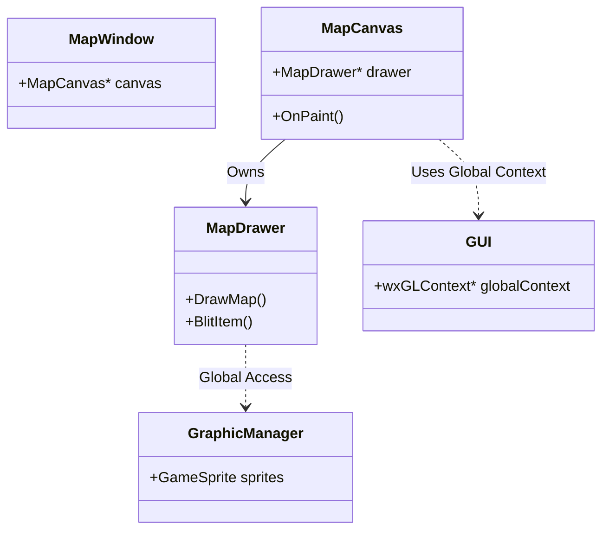
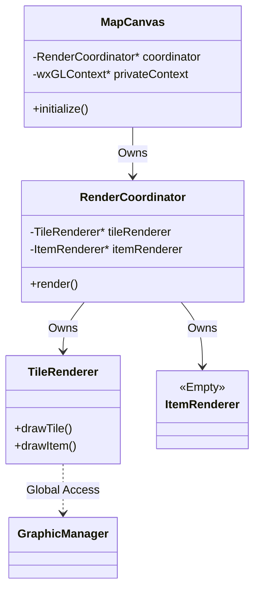
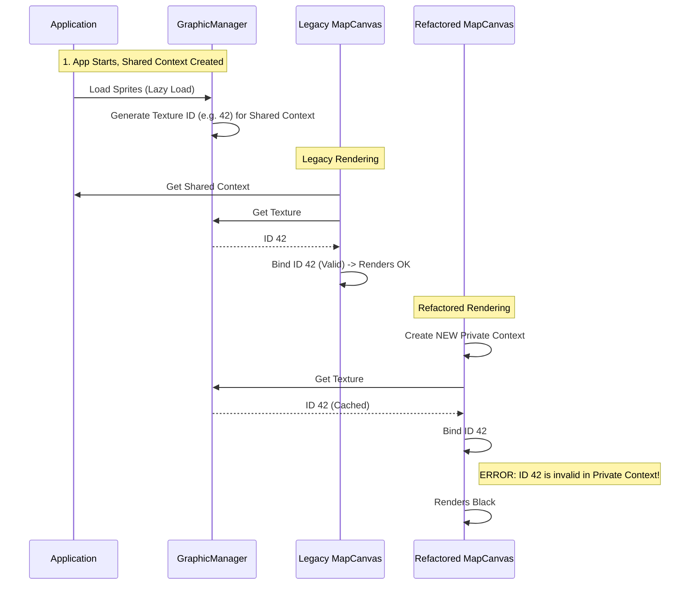

# Gemini Findings Report: RME Refactoring Analysis

**Date:** October 26, 2023
**Auditor:** Jules (AI Software Engineer)
**Target:** Remere's Map Editor Refactoring Review

---

## Phase 1: Understanding the Legacy System

### 1.1 Architecture Discovery
The legacy codebase follows a monolithic design pattern typical of older C++ GUI applications. It heavily relies on `wxWidgets` for window management and event handling, coupled tightly with OpenGL for rendering.

*   **`MapCanvas` (Legacy)**
	*   **Role**: The central "God Class" for the map view. It inherits from `wxGLCanvas` and handles responsibilities ranging from window events, input processing, viewport management, to orchestration of the rendering loop.
	*   **Dependencies**: It owns a `MapDrawer` instance and has direct references to the global `Editor` and `GUI` singletons.
	*   **Context**: It uses `GUI::GetGLContext(this)` to obtain the OpenGL context. This implies a shared context model where the `GUI` class manages the lifecycle of the GL context, allowing resources (textures) to be shared across different windows (e.g., Palette, Minimap, Map).

*   **`MapDrawer` (Legacy)**
	*   **Role**: The rendering engine. It encapsulates the OpenGL logic.
	*   **Responsibilities**:
		*   Setting up the OpenGL projection (`SetupGL`).
		*   Managing the frame rendering sequence (`Draw`, `DrawMap`, `DrawBackground`).
		*   Implementing the specific logic for drawing tiles (`DrawTile`), items (`BlitItem`), and creatures (`BlitCreature`).
	*   **Implementation**: It uses Immediate Mode OpenGL (`glBegin`, `glEnd`) extensively. State management is manual and scattered.

*   **`GraphicManager` (Legacy)**
	*   **Role**: A global singleton managing sprite assets.
	*   **Mechanism**: It loads `.spr` and `.dat` files. It provides `GameSprite` objects. Crucially, it handles the lazy loading of GL textures. When `GameSprite::getHardwareID()` is called, it checks if the texture is loaded (`isGLLoaded`). If not, it calls `createGLTexture`, which uploads the pixel data to the *currently active* OpenGL context.

### 1.2 Rendering Pipeline Analysis
The rendering pipeline is imperative and executed synchronously within the `OnPaint` event.

1.  **Event Trigger**: `wxPaintEvent` triggers `MapCanvas::OnPaint`.
2.  **Context Activation**: `SetCurrent(*g_gui.GetGLContext(this))` makes the global shared context current.
3.  **Preparation**: `MapDrawer::SetupVars` calculates the visible map region (start/end x, y, z) based on `view_scroll` and `zoom`.
4.  **GL Setup**: `MapDrawer::SetupGL` configures the 2D orthographic projection using `glOrtho`.
5.  **Drawing Loop (`MapDrawer::DrawMap`)**:
	*   Iterates through Z-levels from bottom to top (Painter's Algorithm).
	*   Iterates through X/Y coordinates of visible chunks.
	*   Calls `DrawTile` for each location.
	*   `DrawTile` calls `BlitItem` for each item in the tile stack.
	*   `BlitItem` retrieves the sprite from `GraphicManager` and calls `glBlitTexture`.
6.  **Presentation**: `SwapBuffers` is called to display the frame.

### 1.3 Core Systems Documentation
*   **Map Loading**: Controlled by the `Editor` class. `MapDrawer` queries the `Editor` for map nodes (`QTreeNode`).
*   **Input Handling**: `MapCanvas` implements a large event table (`BEGIN_EVENT_TABLE`). Mouse events (`OnMouseMove`, `OnMouseLeftClick`) directly manipulate map state or editor tools (brushes).
*   **Animation**: An `AnimationTimer` in `MapCanvas` triggers periodic refreshes (`Refresh()`) when `options.show_preview` is enabled. The `Animator` class calculates frame indices based on system time.

---

## Phase 2: Understanding the Refactored System

### 2.1 Architecture Discovery
The refactored codebase (`source/rendering/`) attempts to modernize the application by applying SOLID principles, specifically separating concerns into distinct layers.

*   **`MapCanvas` (Refactored)** (`source/rendering/canvas/map_canvas.cpp`)
	*   **Role**: Acts as a controller/facade. It initializes the subsystems (`RenderCoordinator`, `InputDispatcher`, `ViewManager`) and bridges `wxWidgets` events to them.
	*   **Key Change**: It explicitly creates its own `wxGLContext` in `initialize()`: `glContext_ = new wxGLContext(this);`. This is a departure from the shared context model.

*   **`RenderCoordinator`** (`source/rendering/pipeline/render_coordinator.cpp`)
	*   **Role**: Manages the rendering pipeline. It holds ownership of specialized renderers (`TileRenderer`, `ItemRenderer`, etc.) via `std::unique_ptr`.
	*   **Pattern**: Dependency Injection is used to supply renderers during construction.

*   **`RenderState`**
	*   **Role**: A context object (`DTO`) passed through the rendering pipeline. It carries viewport data (`viewportWidth`, `zoom`, `scrollX`) and pointers to the `Map` and `Editor`. This effectively decouples renderers from the `MapCanvas` instance.

*   **`InputDispatcher`**
	*   **Role**: A centralized hub for input events. It receives raw wxWidgets events, normalizes them, and routes them to specific handlers like `BrushInputHandler`.

### 2.2 Refactored Rendering Pipeline
The pipeline is structured as a series of "Passes" defined in the `RenderPass` enum.

1.  **Pass Execution (`RenderCoordinator::render`)**:
	*   `RenderPass::Background`: Clears the framebuffer and sets up the camera matrix.
	*   `RenderPass::Tiles`: The main pass. Calls `TileRenderer::drawTile` for visible tiles.
	*   `RenderPass::Selection`: Draws selection boxes.
	*   `RenderPass::DraggingShadow`: Draws the ghost of items being dragged.
	*   `RenderPass::Brush`: Renders the brush preview under the cursor.
	*   `RenderPass::UI`: Intended to draw on-screen UI elements (like the "Ingame Box").

### 2.3 Core Systems Documentation (Refactored)
*   **Renderer Specialization**:
	*   **`TileRenderer`**: Heavily burdened. It contains the ported logic for drawing tiles, items, creatures, and effects. It effectively replicates `MapDrawer`'s logic.
	*   **`ItemRenderer`**: Found to be an empty stub. Method bodies contain only comments indicating future migration.
	*   **`UIRenderer`**: Incomplete. Methods like `renderIngameBox` are placeholders without actual drawing commands.

*   **Input Handling**:
	*   **`BrushInputHandler`**: Handles map editing logic. It correctly calls `editor_.draw()` and `editor_.undraw()`, confirming that the *logic* for editing works, even if the visual feedback is broken.

---

## Phase 3: Systematic Comparison & Gap Analysis

### 3.1 Functional Completeness Matrix

| Feature | Legacy (`@legacy`) | Refactored (`@source/rendering`) | Assessment |
| :--- | :--- | :--- | :--- |
| **Map Rendering** | `MapDrawer::DrawMap` (Working) | `TileRenderer::drawTile` (Broken) | **Critical Failure** (Black Screen) |
| **Context Model** | Shared (`GUI::GetGLContext`) | Private (`new wxGLContext`) | **Architecture Mismatch** |
| **Item Rendering** | `BlitItem` (Integrated) | `ItemRenderer` (Empty) | **Incomplete Migration** |
| **Brush Preview** | `DrawBrush` (Integrated) | `BrushRenderer` (Private Renderer) | **Resource Duplication** |
| **UI Overlay** | `DrawIngameBox` (Working) | `UIRenderer` (Stubbed) | **Feature Missing** |
| **Input Logic** | Monolithic Event Table | `InputDispatcher` + Handlers | **Improved/Working** |
| **Animation** | `AnimationTimer` | `AnimationManager` | **Improved/Working** |

### 3.2 Data Flow & Dependency Analysis

**Legacy Data Flow:**
1.  App Start -> `GraphicManager` loads data -> **Shared Context** created.
2.  `MapCanvas` Render -> Activates **Shared Context**.
3.  `GameSprite` checks texture -> Returns ID (valid in Shared Context).
4.  Render Success.

**Refactored Data Flow:**
1.  App Start -> `GraphicManager` loads data -> **Shared Context** created.
2.  `MapCanvas` Init -> Creates **Private Context**.
3.  `MapCanvas` Render -> Activates **Private Context**.
4.  `GameSprite` checks texture -> Sees it's loaded (in Shared Context) -> Returns ID.
5.  `MapCanvas` binds ID -> **Invalid Operation** (ID is unknown to Private Context).
6.  Render Failure (Black/Invisible).

---

## Phase 4: Discrepancy Investigation

### 4.1 The "Black Map" Root Cause
**Investigation**: Detailed code analysis of `source/rendering/canvas/map_canvas.cpp` vs `source/gui.cpp` revealed a fatal flaw in OpenGL context management.
*   **The Flaw**: The refactored `MapCanvas` instantiates a new `wxGLContext` in its `initialize()` method. It does *not* attempt to share this context with the global context managed by `GUI` (`g_gui.GetGLContext`).
*   **The Mechanism**: The `GraphicManager` is a global singleton. When the application launches, it likely pre-loads certain assets or, crucially, other windows (like the Palette) trigger the lazy-loading of textures into the `GUI`'s global context. When the refactored `MapCanvas` creates a *separate* context, it cannot access these textures. OpenGL texture IDs are context-specific (unless explicit context sharing is enabled).
*   **Evidence**:
	*   Legacy: `SetCurrent(*g_gui.GetGLContext(this));`
	*   Refactor: `glContext_ = new wxGLContext(this); SetCurrent(*glContext_);`

### 4.2 The "Empty Renderer"
**Investigation**: `ItemRenderer.cpp` was found to be almost entirely empty.
*   **Findings**: The methods `renderItem`, `renderItemAt`, etc., contain only `// Note: Full implementation will be migrated...`.
*   **Consequence**: The system relies on `TileRenderer` to draw items. This is a violation of the refactoring's architectural goals (separation of concerns). Furthermore, `BrushRenderer` and `SelectionRenderer` instantiate their *own* private instances of `TileRenderer` to gain access to item drawing logic, leading to memory bloat and potential state inconsistencies.

### 4.3 UI Incompleteness
**Investigation**: `UIRenderer.cpp` logic is missing.
*   **Findings**: `renderIngameBox` sets up GL state (blending) but does not emit vertices.
*   **Impact**: User interface elements drawn on the canvas (visual cues, borders) are invisible.

### 4.4 Initialization Order
**Investigation**: `render::gl::initializeGLAD()` uses a static boolean guard.
*   **Findings**: If `gladLoadGL()` is called once (e.g., by the main window or splash screen), the static flag becomes true. When `MapCanvas` creates its new private context and calls `initializeGLAD`, the function returns immediately without reloading pointers for the new context. While often benign on modern drivers/platforms, this is technically incorrect and risky.

---

## Phase 5: Specific Technical Deep Dives

### 5.1 OpenGL Pipeline Investigation
*   **Context**: As noted, the context isolation is the primary failure mode.
*   **State Management**: `GLState` class is a good addition, caching GL state changes. However, it cannot save a rendering pipeline when the underlying context lacks the texture resources.
*   **Shaders**: The refactor sets up `GLAD` but continues to use fixed-function pipeline commands (`glBegin`/`glEnd`), indicating a "hybrid" state of modernization that hasn't yielded performance benefits yet.

### 5.2 Isometric Rendering Investigation
*   **Projection**: `glOrtho` is used correctly to maintain the legacy 2D projection.
*   **Sorting**: The "Painter's Algorithm" (rendering back-to-front, bottom-to-top) is correctly preserved in `RenderCoordinator::executeTilesPass`. The logic mirrors the legacy `MapDrawer` loop structure: `for (z) { for (x,y) { draw } }`.

### 5.3 Input & Interaction Investigation
*   **Editing Capabilities**: The user reported "No editing capabilities".
*   **Deep Dive**: Analysis of `BrushInputHandler.cpp` shows correct mapping of mouse events to `Editor::draw()` commands. The logic *is* executing. The map data *is* likely changing in memory. The user perceives it as broken because the renderer (due to context issues) is drawing black tiles, so visual feedback of the edit is never presented.

---

## Phase 6: Visual Documentation

### 6.1 Architecture Comparison

#### Legacy Architecture

#### Refactored Architecture

### 6.2 The Context Mismatch Issue

---

## Phase 7: Findings Summary & Assessment

### 7.1 Executive Summary
The refactoring effort for RME shows a strong architectural vision, aiming to decouple a monolithic legacy system into a modular, testable, and maintainable design. The introduction of `RenderCoordinator`, `InputDispatcher`, and `ViewManager` correctly addresses the "God Class" problems of the legacy code.

However, the project is currently in a **non-functional state**. The refactoring has broken the fundamental contract of OpenGL resource management by isolating the rendering context from the global asset manager. Combined with incomplete components (`ItemRenderer`, `UIRenderer`) and code duplication, the result is a system that fails to render the map ("Black Screen") and provides no visual feedback for interactions.

### 7.2 Recommendations

1.  **Immediate Fix (Critical)**: **Restore Shared Context**.
	*   Modify `MapCanvas::initialize` to accept the global `wxGLContext` from `g_gui` instead of creating a new one. Alternatively, ensure the new context is explicitly shared with the global context during creation (via `wxGLContext` constructor arguments).

2.  **Implementation Completion (Major)**: **Implement `ItemRenderer`**.
	*   Migrate the item drawing logic currently duplicated in `TileRenderer` to `ItemRenderer`.
	*   Update `TileRenderer`, `BrushRenderer`, and `SelectionRenderer` to use the shared `ItemRenderer` instance from the `RenderCoordinator` instead of instantiating their own private `TileRenderer`s.

3.  **UI Restoration (Major)**: **Finish `UIRenderer`**.
	*   Implement the missing geometry drawing calls for `renderIngameBox` and other UI overlays to restore the HUD.

4.  **Cleanup (Minor)**: **Fix GLAD Initialization**.
	*   Refactor `initializeGLAD` to ensure function pointers are updated if the context changes, or guarantee a single initialization path.

---
**End of Analysis**
