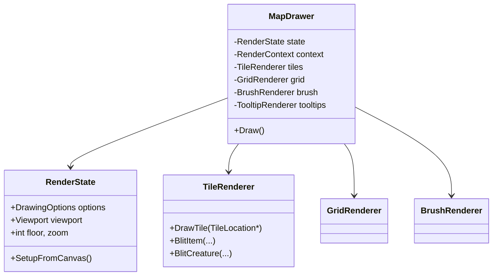
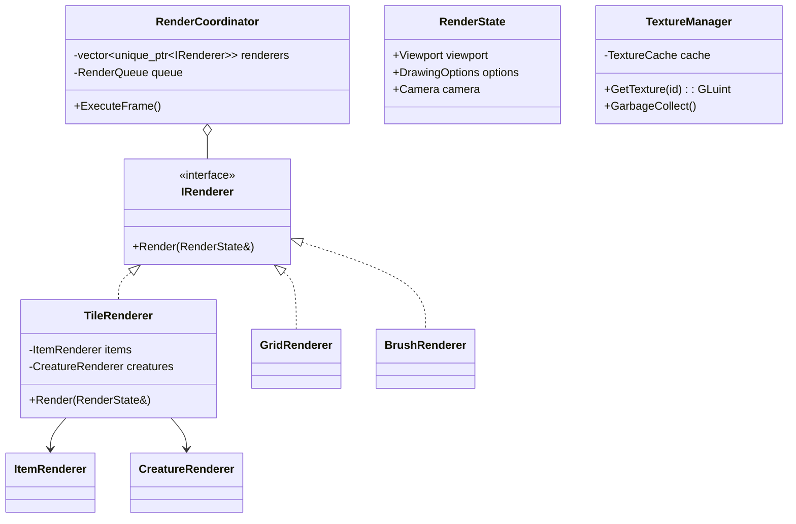
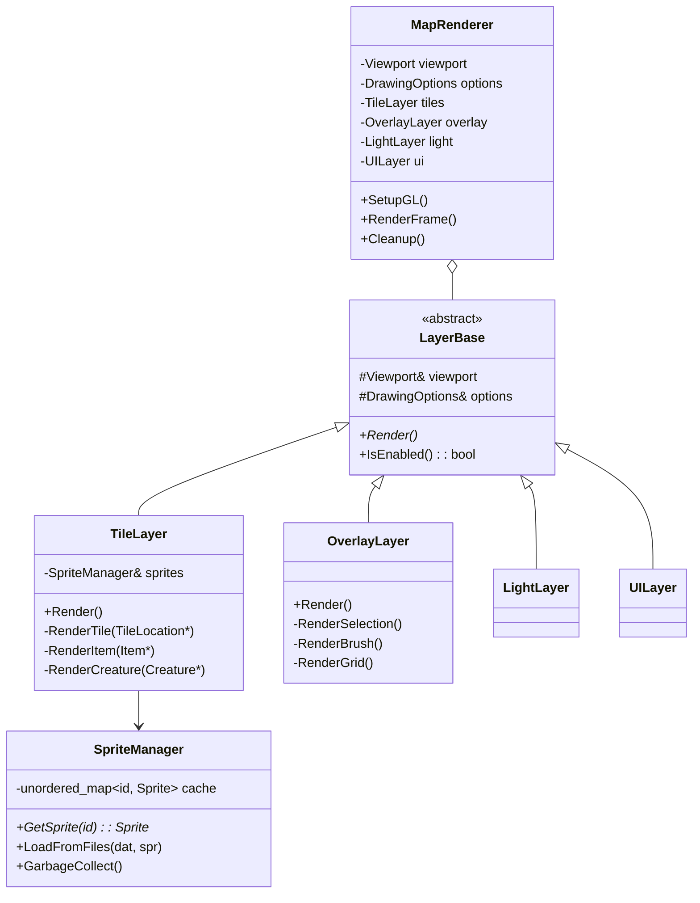
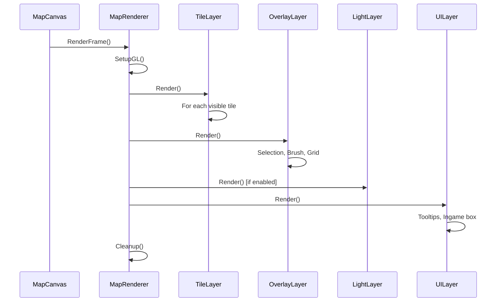

# Rendering Pipeline Refactoring Plan

> **Goal**: Cleanup rendering code following SOLID, Separation of Concerns, AZDO (Almost Zero Driver Overhead mindset), using existing stack with C++20, KISS, DRY.

---

## Current State Analysis

### Monolithic Files (Violations)

| File | Lines | Responsibilities (Violations) |
|------|-------|-------------------------------|
| `map_drawer.cpp` | 2032 | Drawing, state, options, tooltips, brush rendering, grid, lighting delegation |
| `map_display.cpp` | 2764 | Events, rendering trigger, coordinates, screenshots, FPS, input handling |
| `graphics.cpp` | 1623 | Sprite loading, metadata parsing, texture management, garbage collection |

### Core Issues

1. **SRP Violations**: Single classes handle 5+ responsibilities
2. **God Objects**: `MapDrawer` and `MapCanvas` know too much
3. **Tight Coupling**: Rendering mixed with input, UI, and data
4. **DRY Violations**: Repeated coordinate calculations, color handling
5. **No Clear Interfaces**: Concrete dependencies throughout

---

## Constraints

| Constraint | Description |
|------------|-------------|
| ✅ Keep OpenGL 1.x/2.x | No shader migration |
| ✅ Keep wxWidgets | Continue using wxGLCanvas |
| ✅ C++20 allowed | Use modern language features |
| ✅ KISS | Simple, understandable solutions |
| ✅ DRY | Extract common patterns |
| ❌ No new libraries | Use existing dependencies only |

---

## Architectural Propositions

---

# Proposition 1: Minimal Extraction

**Philosophy**: Extract only the most critical components to reduce file sizes. Minimal disruption, quick wins.

## Structure

```
source/rendering/
├── core/
│   ├── render_state.h/cpp          # DrawingOptions + viewport state
│   └── render_context.h/cpp        # OpenGL setup/teardown
├── components/
│   ├── tile_renderer.h/cpp         # DrawTile, BlitItem extracted
│   ├── grid_renderer.h/cpp         # DrawGrid extracted
│   ├── brush_renderer.h/cpp        # DrawBrush extracted
│   └── tooltip_renderer.h/cpp      # DrawTooltips extracted
├── graphics/
│   ├── sprite_loader.h/cpp         # DAT/SPR parsing (from graphics.cpp)
│   ├── texture_cache.h/cpp         # Texture management
│   └── game_sprite.h/cpp           # GameSprite class (from graphics.h)
├── input/
│   └── map_input_handler.h/cpp     # Event handling (from map_display.cpp)
├── map_drawer.h/cpp                # Orchestrator only (~300 lines)
├── map_display.h/cpp               # Canvas only (~500 lines)
└── light_drawer.h/cpp              # Unchanged
```

## Class Design



## Pros/Cons

| Pros | Cons |
|------|------|
| ✅ Minimal risk | ❌ Still some tight coupling |
| ✅ Quick to implement (~1-2 weeks) | ❌ Partial SRP compliance |
| ✅ Easy to review incrementally | ❌ Components share state via pointers |
| ✅ Low merge conflict risk | ❌ Limited future extensibility |

## C++20 Features Used

- `std::span` for buffer views
- `[[nodiscard]]` attributes
- Designated initializers for structs
- `constexpr` where applicable

---

# Proposition 2: Full SoC Decomposition

**Philosophy**: Complete separation of concerns with clear interfaces. Maximum SOLID compliance.

## Structure

```
source/rendering/
├── interfaces/
│   ├── i_renderer.h                # Abstract renderer interface
│   ├── i_sprite_provider.h         # Sprite access interface
│   └── i_render_target.h           # Output target interface
├── state/
│   ├── drawing_options.h/cpp       # Options struct only
│   ├── viewport.h/cpp              # Viewport calculations
│   ├── render_state.h/cpp          # Combined state container
│   └── camera.h/cpp                # View transformation
├── renderers/
│   ├── base_renderer.h             # CRTP base for common code
│   ├── tile_renderer.h/cpp         # Tile drawing
│   ├── creature_renderer.h/cpp     # Creature drawing
│   ├── item_renderer.h/cpp         # Item drawing
│   ├── selection_renderer.h/cpp    # Selection overlay
│   ├── brush_renderer.h/cpp        # Brush preview
│   ├── grid_renderer.h/cpp         # Grid overlay
│   ├── light_renderer.h/cpp        # Lighting (refactored)
│   └── tooltip_renderer.h/cpp      # Tooltips
├── pipeline/
│   ├── render_queue.h/cpp          # Ordered draw commands
│   ├── render_pass.h               # Pass definition
│   └── render_coordinator.h/cpp    # Orchestrates passes
├── texture/
│   ├── texture_manager.h/cpp       # Texture lifecycle
│   ├── sprite_sheet.h/cpp          # Sprite data
│   └── texture_cache.h/cpp         # LRU caching
├── input/
│   ├── input_handler.h/cpp         # Event dispatching
│   ├── coordinate_mapper.h/cpp     # Screen <-> World
│   └── selection_manager.h/cpp     # Selection logic
├── opengl/
│   ├── gl_context.h/cpp            # Context management
│   ├── gl_state.h/cpp              # State tracking
│   └── gl_primitives.h/cpp         # Common GL operations
├── map_canvas.h/cpp                # Thin wxGLCanvas wrapper (~200 lines)
└── map_drawer.h/cpp                # Facade (~150 lines)
```

## Class Design



## Render Pass Order


## Pros/Cons

| Pros | Cons |
|------|------|
| ✅ Full SOLID compliance | ❌ Significant refactoring effort (~4-6 weeks) |
| ✅ Testable components | ❌ More files to manage |
| ✅ Clear extension points | ❌ Higher learning curve |
| ✅ Interface-based design | ❌ Possible over-engineering for simple cases |
| ✅ Easier future migration | ❌ Performance overhead from indirection |

## C++20 Features Used

- Concepts for renderer constraints
- `std::format` for debug output
- Ranges for iteration
- `[[likely]]` / `[[unlikely]]` hints
- Modules (optional, if supported)

---

# Proposition 3: Hybrid Layered Approach (Recommended)

**Philosophy**: Balance between modularity and simplicity. Layer-based separation without over-abstraction.

## Structure

```
source/rendering/
├── core/
│   ├── render_types.h              # Common types, enums (no .cpp)
│   ├── drawing_options.h/cpp       # Options with defaults
│   ├── viewport.h/cpp              # Viewport math
│   └── gl_state.h/cpp              # OpenGL state wrapper
├── layers/
│   ├── layer_base.h                # Common layer interface
│   ├── tile_layer.h/cpp            # Ground + items + creatures
│   ├── overlay_layer.h/cpp         # Selection + brush + grid
│   ├── light_layer.h/cpp           # Lighting (current light_drawer)
│   └── ui_layer.h/cpp              # Tooltips + ingame box
├── sprite/
│   ├── sprite_manager.h/cpp        # Unified loading + caching
│   ├── sprite_types.h              # GameSprite, EditorSprite
│   └── sprite_atlas.h/cpp          # Optional: atlas support
├── utils/
│   ├── coordinate_utils.h          # Screen<->Map conversions
│   ├── color_utils.h               # Color manipulation
│   └── gl_helpers.h                # Common GL patterns (DRY)
├── map_canvas.h/cpp                # wxGLCanvas + input (~800 lines)
└── map_renderer.h/cpp              # Layer orchestrator (~400 lines)
```

## Class Design



## Layer Execution



## Pros/Cons

| Pros | Cons |
|------|------|
| ✅ Good SoC without over-engineering | ❌ Still requires careful interface design |
| ✅ Manageable file sizes (300-800 lines) | ❌ Some coupling between layers |
| ✅ Clear layer concept, easy to understand | ❌ May need iteration on boundaries |
| ✅ Moderate effort (~2-3 weeks) | |
| ✅ Natural extension points | |
| ✅ AZDO-friendly (layers can be optimized independently) | |

## C++20 Features Used

- `std::span` for tile iteration
- `enum class` with `using enum`
- Structured bindings
- `constexpr` functions
- `[[nodiscard]]` on getters

---

## Comparison Matrix

| Criterion | Prop 1 (Minimal) | Prop 2 (Full SoC) | Prop 3 (Hybrid) |
|-----------|------------------|-------------------|-----------------|
| **Effort** | Low (1-2 weeks) | High (4-6 weeks) | Medium (2-3 weeks) |
| **Risk** | Low | High | Medium |
| **SRP Compliance** | Partial | Full | Good |
| **Testability** | Limited | Excellent | Good |
| **Extensibility** | Limited | Excellent | Good |
| **File Count** | +10 | +25 | +15 |
| **Learning Curve** | Low | High | Medium |
| **AZDO Readiness** | Low | High | Medium-High |

---

## Recommended Approach: Proposition 3 (Hybrid)

**Rationale**:
1. Best balance of effort vs. improvement
2. Layer concept is intuitive and maps well to rendering pipeline
3. Allows incremental implementation
4. Clear boundaries without excessive abstraction
5. C++20 features provide meaningful improvements (not just syntax sugar)

---

## Implementation Phases (Proposition 3)

### Phase 1: Foundation (3-4 days)
- [ ] Create `core/` directory with `render_types.h`, `drawing_options.h/cpp`
- [ ] Extract `Viewport` class with coordinate math
- [ ] Create `gl_state.h/cpp` wrapper for common GL patterns
- [ ] Create `utils/` helpers (coordinate_utils, color_utils, gl_helpers)

### Phase 2: Sprite Refactoring (3-4 days)
- [ ] Create `sprite/sprite_manager.h/cpp` from graphics.cpp
- [ ] Extract `sprite_types.h` (GameSprite, EditorSprite moved)
- [ ] Reduce `graphics.cpp` to thin facade or deprecate
- [ ] Update all sprite access to use new manager

### Phase 3: Layer Implementation (4-5 days)
- [ ] Create `layers/layer_base.h` abstract class
- [ ] Extract `TileLayer` from MapDrawer (DrawTile, BlitItem, BlitCreature)
- [ ] Extract `OverlayLayer` (selection, brush, grid)
- [ ] Refactor `LightDrawer` into `LightLayer`
- [ ] Create `UILayer` (tooltips, ingame box)

### Phase 4: Integration (2-3 days)
- [ ] Create `MapRenderer` orchestrator
- [ ] Refactor `MapCanvas` to use `MapRenderer`
- [ ] Update event handling to route through clean interfaces
- [ ] Remove deprecated code from old files

### Phase 5: Cleanup & Testing (2 days)
- [ ] Remove dead code
- [ ] Update includes
- [ ] Manual visual testing
- [ ] Performance comparison

---

## Verification Plan

### Manual Testing Required
1. **Visual Verification**: Compare rendering output before/after
2. **Feature Checklist**:
   - [ ] Tiles render correctly at all zoom levels
   - [ ] Creatures and items display properly
   - [ ] Selection highlighting works
   - [ ] Brush preview renders
   - [ ] Grid toggles on/off
   - [ ] Lighting works when enabled
   - [ ] Tooltips display correctly
   - [ ] Screenshot functionality works
3. **Performance**: FPS should not decrease (measure with `SHOW_FPS_COUNTER`)

> [!IMPORTANT]
> No automated tests exist for rendering. All verification must be manual visual inspection.
> User should confirm which proposition to proceed with before implementation.

---

## User Review Required

Please review the 3 propositions and confirm:
1. Which architectural approach to pursue?
2. Any specific concerns about file boundaries?
3. Any existing patterns in the codebase to follow?
