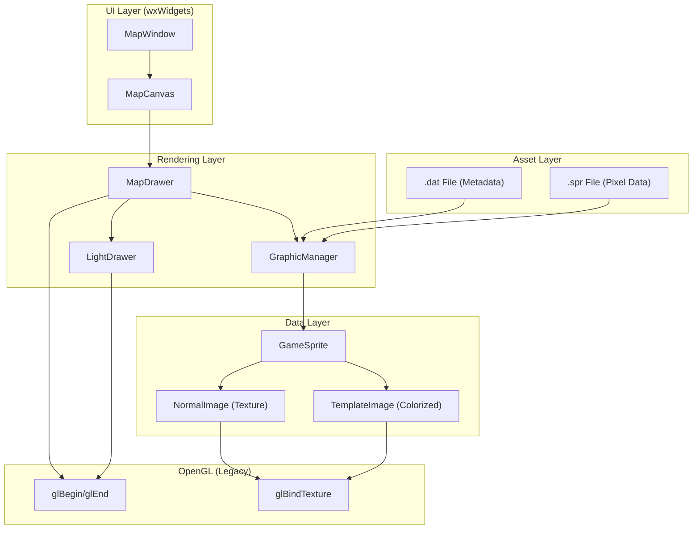
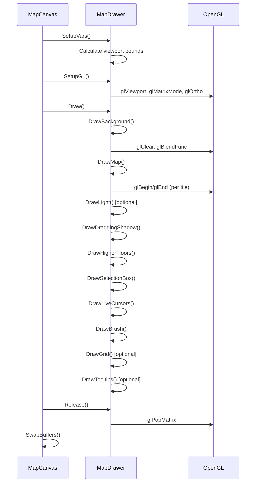
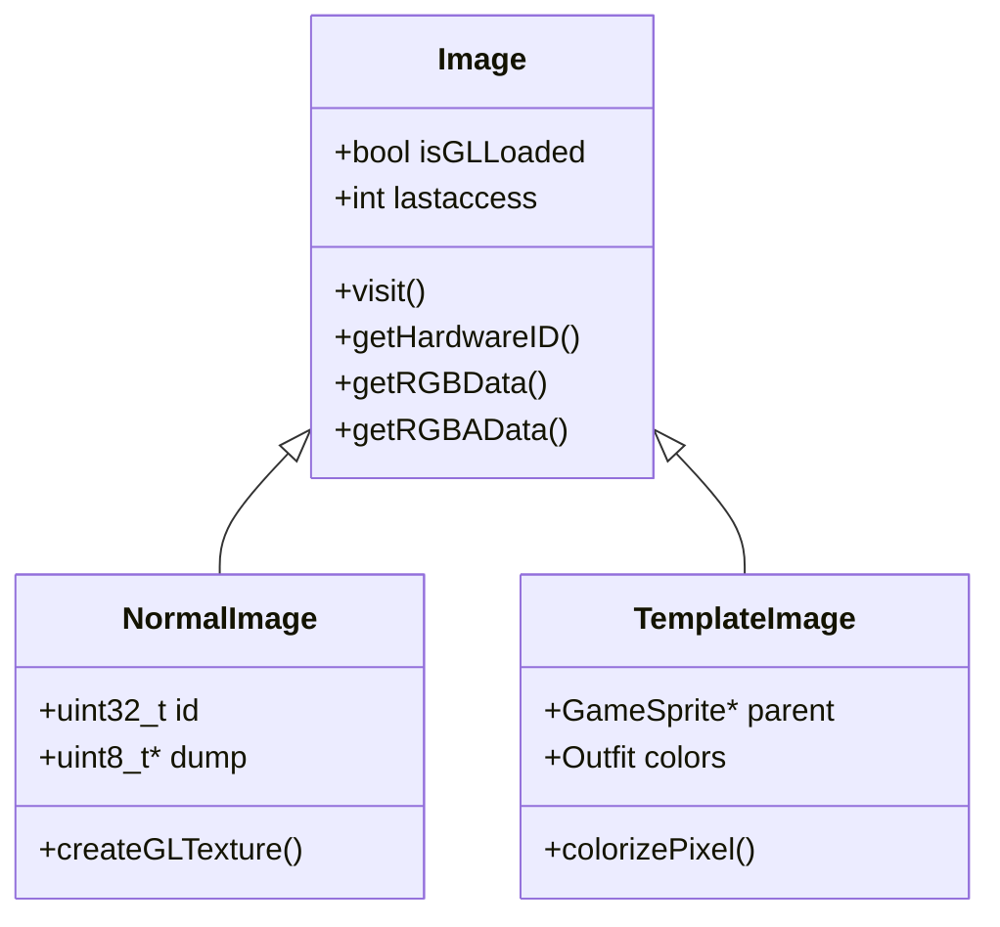
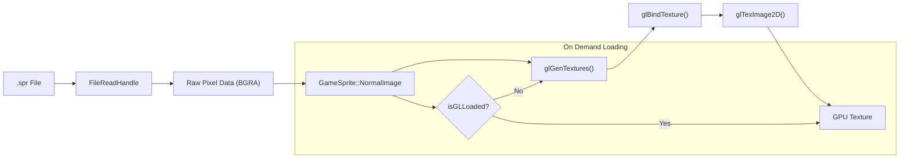
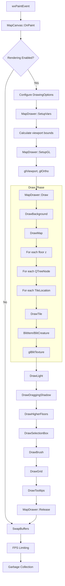
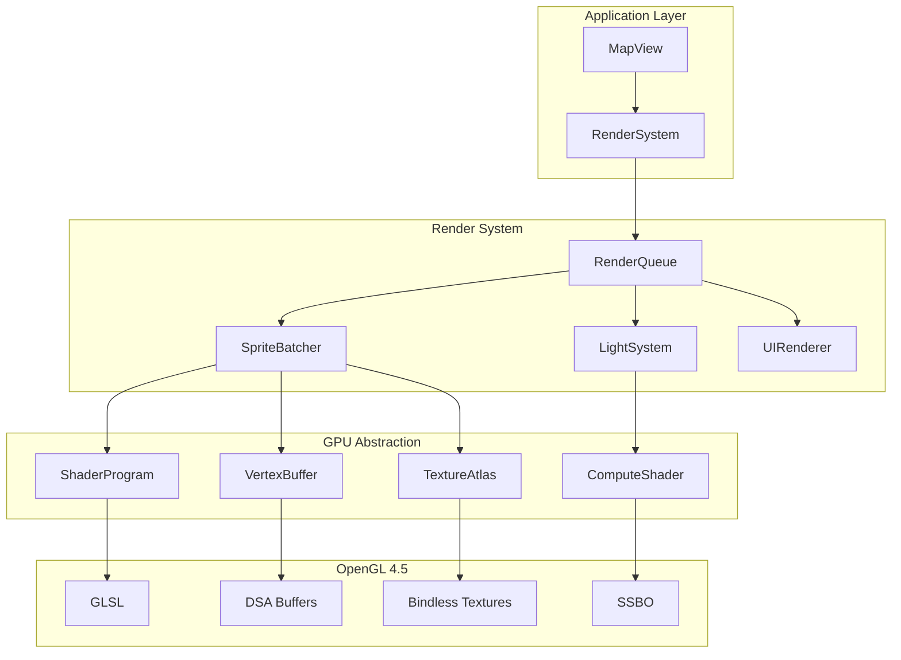

# RME_v2 Rendering Pipeline Documentation

> **Purpose**: Complete documentation of the legacy rendering pipeline for preparing refactoring to OpenGL 4.5 with SRP, SOLID, and AZDO principles.

---

## Executive Summary

The RME_v2 rendering pipeline is a **legacy OpenGL 1.x/2.x immediate-mode** system tightly coupled with **wxWidgets**. It uses deprecated OpenGL functions (`glBegin`/`glEnd`, fixed-function pipeline) and provides no clear separation between rendering logic, UI, and data management.

| Aspect | Current State | Target State (OpenGL 4.5) |
|--------|---------------|---------------------------|
| OpenGL Version | 1.x/2.x (Legacy) | 4.5+ (Modern) |
| Rendering Mode | Immediate Mode | Retained Mode / AZDO |
| Shaders | None (Fixed Pipeline) | GLSL Shaders |
| Draw Calls | Per-Sprite | Batched / Instanced |
| Architecture | Monolithic | SRP/SOLID Compliant |

---

## Technology Stack

### Current Dependencies

| Library | Version | Purpose |
|---------|---------|---------|
| **wxWidgets** | 3.x | UI Framework + OpenGL Context |
| **OpenGL** | 1.x/2.x | Graphics Rendering |
| **GLUT** | Legacy | Utility Functions (glut.h) |
| **libpng/zlib** | - | Sprite/Image Loading |

### Key Files

| File | Lines | Purpose |
|------|-------|---------|
| [map_drawer.cpp](file:///c:/Users/karol/Documents/GitHub/RME_v2/source/rendering/map_drawer.cpp) | 2032 | Main rendering orchestration |
| [map_drawer.h](file:///c:/Users/karol/Documents/GitHub/RME_v2/source/rendering/map_drawer.h) | 187 | MapDrawer class definition |
| [map_display.cpp](file:///c:/Users/karol/Documents/GitHub/RME_v2/source/rendering/map_display.cpp) | 2764 | wxGLCanvas + Event handling |
| [map_display.h](file:///c:/Users/karol/Documents/GitHub/RME_v2/source/rendering/map_display.h) | 221 | MapCanvas class definition |
| [graphics.cpp](file:///c:/Users/karol/Documents/GitHub/RME_v2/source/rendering/graphics.cpp) | 1623 | Sprite/Texture management |
| [graphics.h](file:///c:/Users/karol/Documents/GitHub/RME_v2/source/rendering/graphics.h) | 432 | Graphics classes definition |
| [light_drawer.cpp](file:///c:/Users/karol/Documents/GitHub/RME_v2/source/rendering/light_drawer.cpp) | 156 | Lighting system |
| [light_drawer.h](file:///c:/Users/karol/Documents/GitHub/RME_v2/source/rendering/light_drawer.h) | 89 | LightDrawer class definition |

---

## Architecture Overview



---

## Core Classes

### 1. MapCanvas (wxGLCanvas)

**File**: [map_display.h](file:///c:/Users/karol/Documents/GitHub/RME_v2/source/rendering/map_display.h)

The primary rendering surface inheriting from `wxGLCanvas`. Handles:
- OpenGL context management
- Input events (mouse, keyboard)
- Frame rate control

```cpp
class MapCanvas : public wxGLCanvas {
    MapDrawer* drawer;        // Rendering logic
    AnimationTimer* animation_timer;
    int floor;                // Current Z-level
    double zoom;              // Zoom factor
    // ... event handlers
};
```

**Key Methods**:
| Method | Purpose |
|--------|---------|
| `OnPaint()` | Main render loop entry point |
| `SetZoom()` | Adjusts zoom level |
| `ScreenToMap()` | Screen-to-world coordinate conversion |
| `TakeScreenshot()` | Captures current view |

---

### 2. MapDrawer

**File**: [map_drawer.h](file:///c:/Users/karol/Documents/GitHub/RME_v2/source/rendering/map_drawer.h)

Core rendering orchestrator. Contains all drawing logic.

```cpp
class MapDrawer {
    MapCanvas* canvas;
    Editor& editor;
    DrawingOptions options;
    std::shared_ptr<LightDrawer> light_drawer;
    
    // Performance optimization
    GLuint last_bound_texture_ = 0;  // Texture bind caching
};
```

**Render Pipeline Flow**:


**Drawing Methods**:
| Method | Lines | Description |
|--------|-------|-------------|
| `Draw()` | 203-225 | Main orchestrator |
| `DrawBackground()` | 227-239 | Clear + blend setup |
| `DrawMap()` | 249-444 | Tile iteration + rendering |
| `DrawTile()` | Internal | Single tile rendering |
| `DrawGrid()` | 506-520 | Grid overlay |
| `DrawLight()` | - | Calls LightDrawer |
| `BlitItem()` | 1054-1186 | Item/sprite rendering |
| `BlitCreature()` | - | Creature rendering |
| `glBlitTexture()` | - | Low-level texture quad |

---

### 3. DrawingOptions

**File**: [map_drawer.h](file:///c:/Users/karol/Documents/GitHub/RME_v2/source/rendering/map_drawer.h) (Lines 47-88)

Configuration struct for rendering options:

```cpp
struct DrawingOptions {
    bool transparent_floors;
    bool transparent_items;
    bool show_ingame_box;
    bool show_lights;
    bool show_grid;
    bool show_creatures;
    bool show_spawns;
    bool show_houses;
    bool show_shade;
    bool show_special_tiles;
    bool show_items;
    bool highlight_items;
    bool show_blocking;
    bool show_tooltips;
    bool show_as_minimap;
    bool show_preview;
    bool experimental_fog;
    // ... more options
};
```

---

### 4. LightDrawer

**File**: [light_drawer.h](file:///c:/Users/karol/Documents/GitHub/RME_v2/source/rendering/light_drawer.h)

Handles dynamic lighting overlay using a CPU-computed texture.

```cpp
class LightDrawer {
    struct Light {
        uint16_t map_x, map_y;
        uint8_t color, intensity;
    };
    
    GLuint texture;
    std::vector<Light> lights;
    std::vector<uint8_t> buffer;  // CPU light buffer
    
    // Caching
    bool dirty_ = true;
    int last_view_x_, last_view_y_, last_floor_;
};
```

**Light Rendering Process**:
1. Collect lights from visible tiles
2. Compute intensity per-pixel on CPU
3. Upload to GL texture via `glTexImage2D`
4. Blend over scene using `glBlendFunc(GL_DST_COLOR, GL_ONE_MINUS_SRC_ALPHA)`

---

### 5. GraphicManager

**File**: [graphics.h](file:///c:/Users/karol/Documents/GitHub/RME_v2/source/rendering/graphics.h)

Central sprite and texture management.

```cpp
class GraphicManager {
    SpriteMap sprite_space;     // All loaded sprites
    ImageMap image_space;       // Texture data
    ClientVersion* client_version;
    
    // State
    uint16_t item_count;
    uint16_t creature_count;
    int loaded_textures;
};
```

**Key Methods**:
| Method | Purpose |
|--------|---------|
| `loadSpriteMetadata()` | Parse .dat file |
| `loadSpriteData()` | Parse .spr file |
| `getSprite()` | Retrieve sprite by ID |
| `getCreatureSprite()` | Retrieve creature sprite |
| `garbageCollection()` | Cleanup unused textures |
| `getFreeTextureID()` | Allocate GL texture ID |

---

### 6. GameSprite

**File**: [graphics.h](file:///c:/Users/karol/Documents/GitHub/RME_v2/source/rendering/graphics.h) (Lines 78-207)

Sprite metadata and texture holder.

```cpp
class GameSprite {
    uint32_t id;
    uint8_t width, height;
    uint8_t layers, pattern_x, pattern_y, pattern_z;
    uint8_t frames;
    Animator* animator;
    SpriteLight light;
    
    // Nested image classes
    class NormalImage;    // Standard texture
    class TemplateImage;  // Colorized outfit
    
    std::vector<NormalImage*> spriteList;
};
```

**Image Hierarchy**:


---

## OpenGL Usage Analysis

### Deprecated Functions Used

| Category | Functions | Count |
|----------|-----------|-------|
| **Immediate Mode** | `glBegin`, `glEnd`, `glVertex2f` | ~100+ |
| **Fixed Pipeline** | `glMatrixMode`, `glLoadIdentity`, `glOrtho`, `glPushMatrix`, `glPopMatrix` | ~20 |
| **Color State** | `glColor4ub`, `glColor4f` | ~50 |
| **Texture (Legacy)** | `glBindTexture`, `glTexImage2D`, `glTexParameteri` | ~10 |
| **Line Attributes** | `glLineStipple`, `glLineWidth` | ~5 |
| **Alpha Test** | `glBlendFunc`, `glEnable(GL_BLEND)` | ~10 |

### Immediate Mode Example (Current)

```cpp
// map_drawer.cpp Line 506-519
void MapDrawer::DrawGrid() {
    glColor4ub(255, 255, 255, 128);
    glBegin(GL_LINES);
    for (int y = start_y; y < end_y; ++y) {
        glVertex2f(start_x * TileSize - view_scroll_x, y * TileSize - view_scroll_y);
        glVertex2f(end_x * TileSize - view_scroll_x, y * TileSize - view_scroll_y);
    }
    for (int x = start_x; x < end_x; ++x) {
        glVertex2f(x * TileSize - view_scroll_x, start_y * TileSize - view_scroll_y);
        glVertex2f(x * TileSize - view_scroll_x, end_y * TileSize - view_scroll_y);
    }
    glEnd();
}
```

---

## Texture Pipeline



### Texture Management

| Feature | Implementation |
|---------|----------------|
| Loading | On-demand (lazy) |
| Format | RGBA 8-bit |
| Size | 32x32 pixels per sprite |
| Caching | `last_bound_texture_` optimization |
| Cleanup | `garbageCollection()` based on access time |

---

## Rendering Loop Flow



---

## Performance Bottlenecks

### Identified Issues

| Issue | Location | Impact |
|-------|----------|--------|
| Per-tile draw calls | `DrawTile()` | High CPU overhead |
| Immediate mode rendering | All `glBegin/glEnd` | No GPU batching |
| CPU light computation | `LightDrawer::draw()` | Per-frame texture upload |
| No frustum culling | `DrawMap()` loops | Unnecessary iterations |
| State changes per sprite | `glBlitTexture()` | Context switching |
| No instancing | Throughout | Missed GPU parallelism |

### Current Optimizations

| Optimization | Location | Description |
|--------------|----------|-------------|
| Texture bind caching | `last_bound_texture_` | Avoids redundant binds |
| Light caching | `LightDrawer::needsUpdate()` | Skip if view unchanged |
| Zoom-based LOD | `zoom > 3.0` checks | Skip details when zoomed out |
| Grid batching | `DrawGrid()` | Single `glBegin/glEnd` block |

---

## Directory Structure

```
source/rendering/
├── core/               # Empty (reserved)
├── gl/                 # Empty (reserved for GL utilities)
├── shaders/            # Empty (no shaders currently)
├── graphics.cpp        # Sprite/texture loading
├── graphics.h          # GraphicManager, GameSprite classes
├── light_drawer.cpp    # Lighting implementation
├── light_drawer.h      # LightDrawer class
├── map_display.cpp     # MapCanvas (wxGLCanvas)
├── map_display.h       # MapCanvas definition
├── map_drawer.cpp      # Main rendering logic
├── map_drawer.h        # MapDrawer, DrawingOptions
├── minimap_window.cpp  # Minimap rendering
├── minimap_window.h    # Minimap class
└── sprites.h           # Sprite ID constants
```

---

## Refactoring Recommendations

### SRP Violations to Address

| Current Class | Responsibilities | Proposed Split |
|---------------|------------------|----------------|
| `MapDrawer` | Drawing, State, Options, Tooltips | `Renderer`, `RenderState`, `TooltipManager` |
| `MapCanvas` | Events, Rendering, Coordinates | `InputHandler`, `Canvas`, `CoordinateMapper` |
| `GraphicManager` | Loading, Caching, GL Textures | `SpriteLoader`, `TextureCache`, `TextureFactory` |
| `GameSprite` | Metadata, Image Data, Animation | `SpriteMetadata`, `SpriteImage`, `Animator` |

### OpenGL 4.5 Migration Path

1. **Phase 1: Abstraction Layer**
   - Create `IRenderer` interface
   - Wrap all GL calls in abstraction

2. **Phase 2: Shader Pipeline**
   - Implement GLSL vertex/fragment shaders
   - Create `ShaderProgram` class
   - Migrate from fixed-function to programmable

3. **Phase 3: Batching**
   - Implement `SpriteBatcher` class
   - Use VAO/VBO for geometry
   - Texture atlasing

4. **Phase 4: AZDO**
   - Persistent mapped buffers
   - Bindless textures
   - Indirect draw calls
   - Multi-draw indirect

### Proposed Modern Architecture



---

## Key Constants

| Constant | Value | Location |
|----------|-------|----------|
| `TileSize` | 32 | Global |
| `GROUND_LAYER` | 7 | definitions.h |
| `MAP_MAX_LAYER` | 15 | definitions.h |
| `MAP_MAX_WIDTH` | 65536 | definitions.h |
| `MAP_MAX_HEIGHT` | 65536 | definitions.h |
| `MaxLightIntensity` | 8 | light_drawer.h |
| `PixelFormatRGBA` | 4 | light_drawer.cpp |

---

## Next Steps

1. [ ] Create abstraction layer for OpenGL calls
2. [ ] Implement shader compilation infrastructure
3. [ ] Design texture atlas system
4. [ ] Create sprite batching system
5. [ ] Implement modern light rendering (GPU-based)
6. [ ] Remove wxWidgets rendering dependencies
7. [ ] Implement retained mode rendering

> [!IMPORTANT]
> The shaders directory is currently empty. A complete shader system must be built from scratch.

> [!WARNING]
> The tight coupling with wxWidgets (`wxGLCanvas`, `wxColor`, `wxBitmap`) will require significant refactoring to achieve a clean separation.
